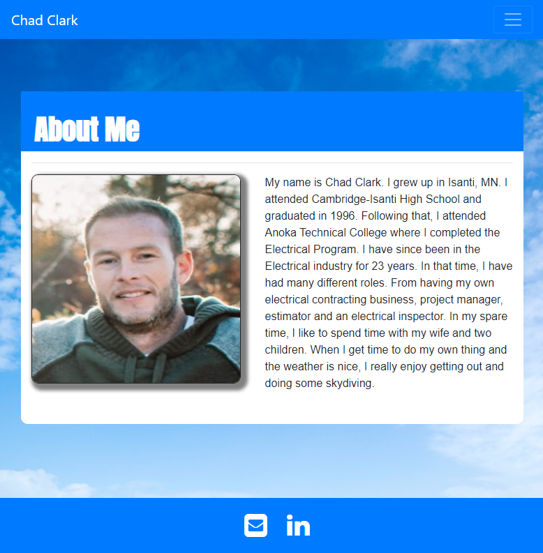

## About-Me-Webpage

My About Me webpage was a project that the task was to build a responsive website using the Bootstrap container method and plug-ins.
:zap:

## Motivation

My motivation for this project was to challenge myself as a new student developer. While there were many obstacles along the way, I took great enjoyment in overcoming those challenges.
:zap:

## Project Links

https://github.com/chadclark1234/About-Me-Webpage

https://chadclark1234.github.io/About-Me-Webpage/

## Credits

I would like to thank my instructors and tutor who have been supportive and helpful with challenges I could not overcome myself. :mega:
git s
